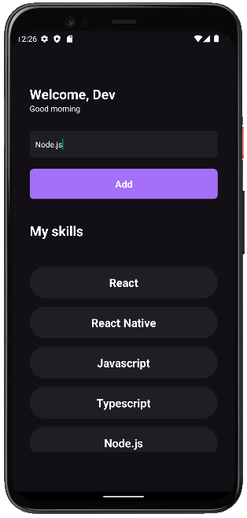

# ignite-react-native-Chapter1

Primeiro modulo do curso de React Native do ignite da Rocketseat. App de adicionar skills.

## :star: Get Started

``` bash
# instalar dependências
yarn install
```

``` bash
# Rodar o projeto no emulador ou no celular atravéz do cabo usb
yarn android or yarn ios
```

``` bash
# Se por acaso der um erro ao startar o projeto, limpe o cache do emulador 
```

### Demo
<div style="display: flex; flex-direction: column">
 
</div>